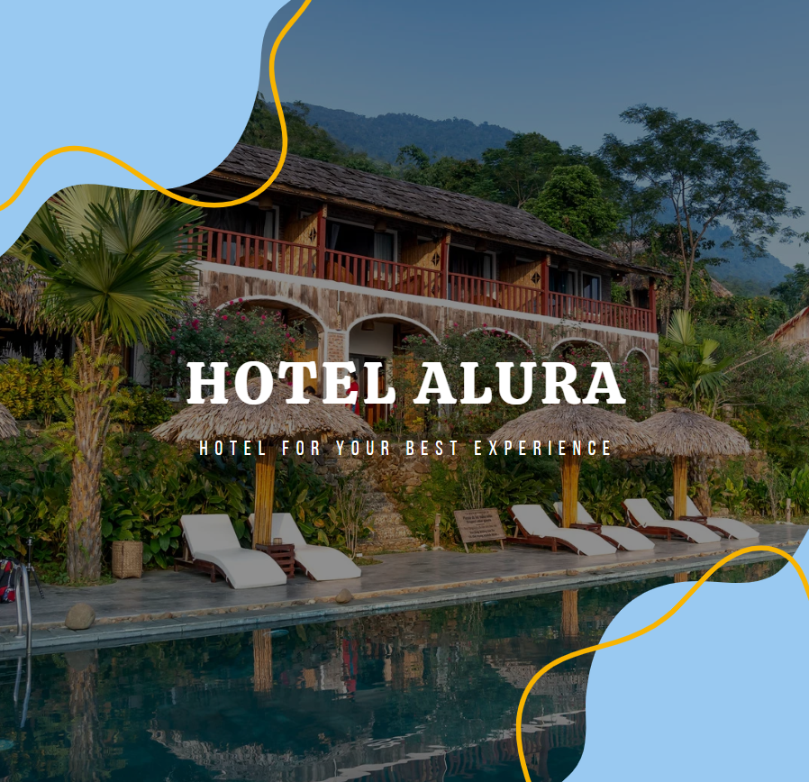

# Challenge ONE | Java | Back-end | Hotel Alura

     

---
#### 🔹Proyecto en Alura: (https://www.aluracursos.com/challenges/oracle-one-back-end/hotelalura) 📃
 

## 🖥️ Tecnologías Utilizadas:

- Java 17
- Eclipse IDE
- Biblioteca JCalendar
- MySql
- WindowBuilder  

---
## ⚠️ Características ⚠️

🎨 El proyecto es un sistema simple de reservas y huéspedes de un Hotel. 

Su interfaz gráfica consiste en:

<ul>
     <li>Pantalla de Bienvenida</li>
     <li>Pantalla de Login</li>
     <li>Menú Principal desde el cual podemos escoger entre búsqueda o registro de reservas</li>
     <li>Pantalla de búsqueda por Id de Reserva o Apellido de huésped</li>
     <li>Pantalla de registro de reservas</li>
</ul>

Dentro de la pantalla de búsqueda, podemos seleccionar una reserva o un huésped, y modificarla o eliminarla.
          

#### Se utilizaron los patrones de diseño:

<ul>
     <li>Modelo Vista Controlador</li>
     <li>Data Access Object (DAO)</li>
</ul>

## 📬 Entrega

### ¿Cómo incluir mi proyecto con el "#" del desafío?

1) Ten el <strong>Fork</strong> del proyecto en tu repositorio en Github.
2) Utiliza el topico **challengeonehotelaluralatam4**  
3) Ve a la pestaña derecha de tu proyecto y haz clic en el engranaje de configuración en la sección <em>About</em>, selecciona el campo **topics** e inserae la etiqueta **challengeonehotelaluralatam4**

### ¿Cómo hago la entrega final de mi Proyecto?

4) Rellena el siguiente formulario con tus datos personales, junto con el enlace de tu repositorio. 🔹 [Link para o formulário](https://lp.alura.com.br/alura-latam-entrega-challenge-one-esp-back-end)

     

5) Ve a tu correo electrónico y canjea tu insignia obtenida al completar otro desafío del Proyecto ONE! 🏆

6) ¡No olvides poner un enlace o video de tu proyecto en Linkedin! Etiqueta a #Oracle y #AluraLatam 🏁

🧡 <strong>Oracle</strong> 

💙 <strong>Alura Latam</strong> 

